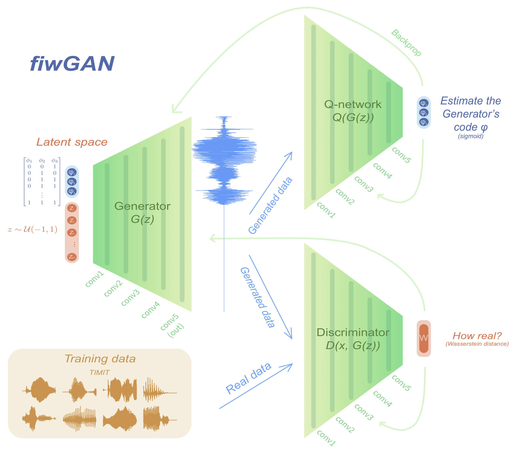
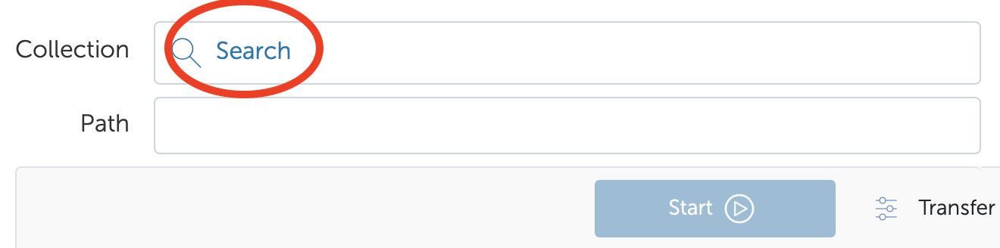
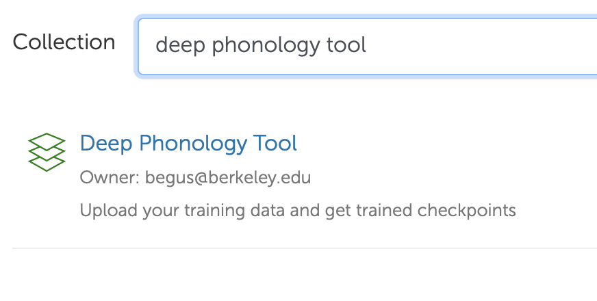
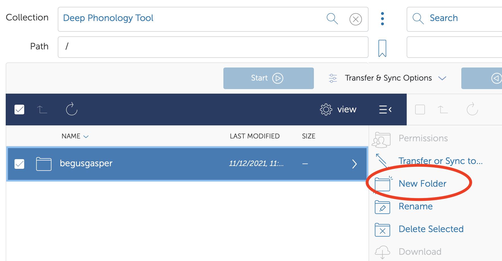
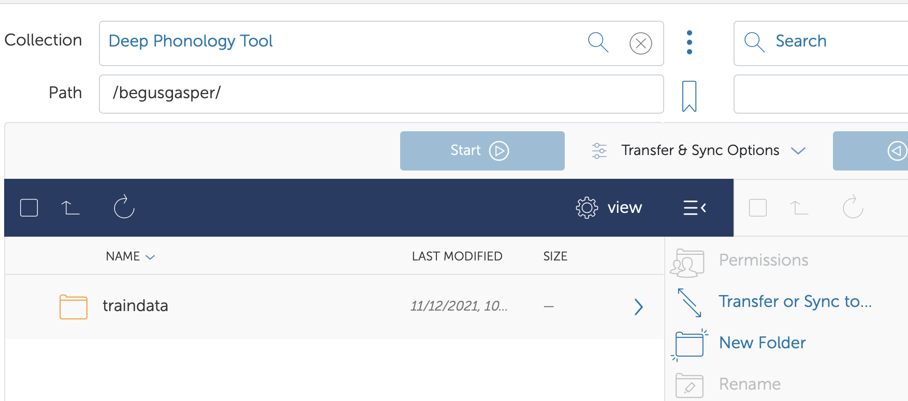

# Deep Phonology Tool

This tool allows you to train your own fiwGAN or a ciwGAN models using our GPUs in a high performance computing space. The paper describing the models is here:

- Beguš, Gašper. 2021. CiwGAN and fiwGAN: Encoding information in acoustic data to model lexical learning with Generative Adversarial Networks. *Neural Networks* 139: 305–325. doi: https://doi.org/10.1016/j.neunet.2021.03.017

The main elements of the architecture (fiwGAN):

Papers that use the models:

- Beguš, Gašper. 2021. Identity-Based Patterns in Deep Convolutional Networks: Generative Adversarial Phonology and Reduplication. *Transactions of the Association for Computational Linguistics* 9: 1196–1212. [doi](https://doi.org/10.1162/tacl_a_00421)
- Beguš, Gašper and Alan Zhou. 2022. Interpreting intermediate convolutional layers in unsupervised acoustic word classi􏰁cation. *ICASSP 2022 - 2022 IEEE International Conference on Acoustics, Speech􏰋 and Signal Processing*: 8207-8211. [doi](https://doi.org/10.1109/ICASSP43922.2022.9746849)
- Beguš, Gašper and Alan Zhou. 2022. Interpreting intermediate convolutional layers of generative CNNs trained on waveforms. *IEEE/ACM Transactions on Audio, Speech, and Language Processing* [doi](https://doi.org/10.1109/TASLP.2022.3209938)
- Beguš, Gašper and Alan Zhou. 2022. Modeling speech recognition and synthesis simultaneously: Encoding and decoding lexical and sublexical semantic information into speech with no direct access to speech data. *Proc. Interspeech 2022*. [doi](http://doi.org/10.21437/Interspeech.2022-11219)

The code is here: https://github.com/gbegus/fiwGAN-ciwGAN

# Train your own model

## Create a Globus account  

[Globus](https://www.globus.org/) is a UChicago non-profit service for transferring files. You will use Globus to upload files for training.

To create a Globus account, follow these steps: [instructions](https://docs.globus.org/how-to/get-started/).

To enable file transfer from your local computer, follow these steps: 

- [Mac](https://docs.globus.org/how-to/globus-connect-personal-mac/)
- [Linux](https://docs.globus.org/how-to/globus-connect-personal-linux/)
- [Windows](https://docs.globus.org/how-to/globus-connect-personal-windows/)

## Fill out a Google form

Fill out [this Google form](https://forms.gle/QAXmbq9UBsGbR1Uu9) where you set the hyperparameters of the model you wish to train, briefly describe your project, and give us your Globus ID. 
 
## Wait for review

Once you submit the Google form, we will review your request and set up your permissions in our high performance computing space. This might take a few days. We might not be able to approve all requests. 
 

## Prepare training data

All files for training need to be in `.wav` format with 16-bit quantization and 16kHz sampling rate. The model won't run unless the files are in the correct format. The files also generally need to be less than 1 s long.

## Upload training data 
 
1. Once you get permission, click on the link you received to your email. Alternatively, you can log into your Globus account and find the Deep Phonology Tool.

Search for Deep Phonology Tool.

2. Create a new folder in your directory and give it a title `/traindata/`. Upload your training files to `/traindata/`. The username `begusgasper` will be replaced with your Globus username.

4. Fill out [this form](https://forms.gle/SDdqZhVQtguzrEmv5) to start training.

## Get training checkpoints

You should see trained checkpoints in your directory soon after you submit the second Google form. The training will go on for 24-72 hours (on Nvidia K80, 1080Ti, or 2080Ti). If you need more time, you can resubmit the request. 

## Suggestions

We're in the process of adding more training features and we're happy to hear suggestions for improving the tool. If you have a specific request for a particular architecture modification, email begus@berkeley.edu.
